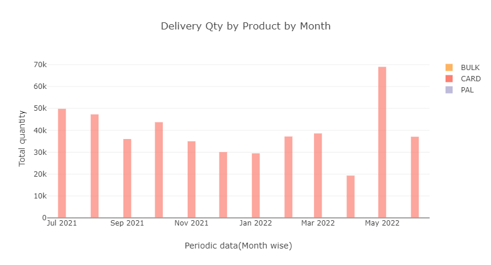
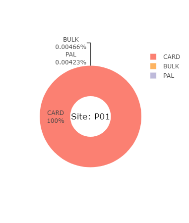

<a name="readme-top"></a>

<!-- PROJECT LOGO -->
<br />
<div align="center">
  <a href="https://github.com/ArchanaKarri/Project-3.git">
    
  </a>

<h3 align="center">Project 3</h3>

  <p align="center">
    Project 3 (We can call this something more specific)
    <br />
    <a href="https://github.com/ArchanaKarri/Project-3.git"><strong>Explore the docs »</strong></a>
    <br />
    <br />
    <a href="https://github.com/ArchanaKarri/Project-3/Project-03Presentation.pptx">View Presentation</a>
    ·
    <a href="https://github.com/ArchanaKarri/Project-3/issues">Report Bug</a>
  </p>
</div>


<!-- TABLE OF CONTENTS -->
<details>
  <summary>Table of Contents</summary>
  <ol>
    <li>
      <a href="#about-the-project">About The Project</a>
      <ul>
        <li><a href="#why-this-topic">Why this topic?</a></li>
      </ul>
    </li>
    <li>
      <a href="#getting-started">Getting Started</a>
      <ul>
        <li><a href="#installation">Installation</a></li>
        <li><a href="#push-data-to-tables">Push Data To Tables</a></li>
      </ul>
    </li>
    <li>
      <a href="#running-app">Running app.py</a>
      <ul>
        <li><a href="#installing-dependencies">Installing Dependencies</a></li>
        <li><a href="#run-app">Run app.py</a></li>
        <li><a href="#results">Results</a></li>
      </ul>
    </li>
    <li><a href="#analysis">Analysis</a></li>
    <li><a href="#creators">Creators</a></li>
    <li><a href="#citing-and-referencing">Citing and Referencing</a></li>
  </ol>
</details>


<!-- ------------- ABOUT THE PROJECT ------------- -->
## About The Project

The data set we are using for this project contains the delivery information for a manufacturing company. We are attempting to identify if there are any trends with product type and its delivery. The data has multiple sites and is across a financial year. We are hoping we may be able to find seasonal trends and/or areas that are high users of certain products.


<p align="right">(<a href="#readme-top">back to top</a>)</p>

<!-- ---- Why this topic? ---- -->
## Why this topic?

When looking into our project topic we wanted to keep the data specific to the industries that we are familiar with. We have decided to use an output from a company that one of us is currently employed (With permission). This way we are able to use real data, specific to one member, to generate useful and meaningful visuals that can be used in real world situations.
 


<p align="right">(<a href="#readme-top">back to top</a>)</p>


<!-- ------------- GETTING STARTED ------------- -->
## Getting Started

To get a local copy up and running follow these simple example steps.

<!-- ---- installation ----- -->

### Installation
 
1. Install "PostgreSQL" through this link https://www.postgresql.org/download/

2. Select your operating system.

3. Click on the "Download the installer" link

4. Download the latest version avaiable

6. Once downloaded, open the installer and follow the steps to complete the installation

5. If you need any help with the installation of PostgreSQL you can find install resoures here https://www.postgresql.org/docs/current/tutorial-install.html


#### pgAdmin

1. Clone the repo
   ```sh
   git clone https://github.com/ArchanaKarri/Project-3.git
   ```
2. Open pgAmin and create a new database called 
   ```js
   shipment
   ```
3. Right click on the shipment database and click on `Query tool`
   
4. Within the Query Tool, open and run file called `PGAdmin_table_schema.sql` located
   ```js
   Where_you_cloned_the_repo + \PGAdmin_table_schema.sql
   ```

    You now have your tables and columns created. Next we will populate these tables with data.


<p align="right">(<a href="#readme-top">back to top</a>)</p>

<br>

<!-- ---- push-data-to-tables ---- -->
### Push data to tables

1. Create a python file called `config.py` and save it in the folder "SQL-challenge".

2. Within the config.py copy and paste the code below. 

```
protocol = 'postgresql'
username = "ENTER POSTGRES USERNAME"
password = "ENTER PASSWORD HERE"
host = 'localhost'
port = 5432     #This may be a different port number
database_name = 'shipment'  #Make sure this is the same name database name as the one you created earlier

```

3. Enter in your username and password for PG Admin.

4. Locate file called coordinates.ipynb found in folder "PROJECT-3"

5. Open coordinates.ipynb in any application that can run a Jupyter notebook.

6. Refresh and clear the kernal. Click on "Run all"

The end result will display the data that has just been read into the shipment database.


<p align="right">(<a href="#readme-top">back to top</a>)</p>


<!-- ------------- running-app.py ------------- -->
## Running-app
To get a local copy up and running follow these simple example steps.
Serving Flask app "app" (lazy loading)
 * Environment: production
   WARNING: This is a development server. Do not use it in a production deployme
nt.
   Use a production WSGI server instead.
 * Debug mode: on
 * Restarting with watchdog (windowsapi)
 * Debugger is active!
 * Debugger PIN: 953-404-923
 * Running on http://127.0.0.1:5000/ (Press CTRL+C to quit)
<br>

<p align="right">(<a href="#readme-top">back to top</a>)</p>


<!-- -----installing-dependencies---- -->
### Installing dependencies

list of all the dependencies that will need to be installed

pip install SQLAlchemy
pip install numpy
pip install Flask
pip install DateTime


<p align="right">(<a href="#readme-top">back to top</a>)</p>


<!-- -----run-app.py---- -->
### Run app

steps to run app.py

The most basic and easy way to run a Python script is by using the python command. You need to open a command line and type the word python followed by the path to your script file, like this:

python app.py

<p align="right">(<a href="#readme-top">back to top</a>)</p>


<!-- -----results---- -->
### Results

Our results are stored in the pictorial representation
 
 Bar chart</br>
<a href="Bar chart"> 
	 
</a> </br>
 Pie chart</br>
 <a href="Pie chart"> 
	 
</a> </br>

 Maps </br>
 <a href="Maps"> 
	 
</a></br>

<p align="right">(<a href="#readme-top">back to top</a>)</p>


<!-- ------------- Analysis ------------- -->
## Analysis

For our project we used the data from multiple sites located across Australia. Using the code, we are able to retrieve the data from the database and visualise them to identify any patterns or trends.
For that purpose ,we used  different visual summary techniques to represent our data.
1. Summary information</br>
<p>For a selected site from the list, this Summary info label will display the Highest Delivered Product type and Highest Delivered Part. Also we used anime.js to display the data

</p>
2.  Bar chart</br>
<p>For a selected site from the list, bar chart is used to analyse the data for a particular site across a certain period of time.
For instance you can understand that the total sales are low during the December period. This may be due to business closures during the holidays.

June- There is a increase in the total number of sales over the past few months. This may be to use the budget allocation for the current financial year etc.
</p></br>
3.  Pie chart</br>
<p>For a selected site from the list, pie chart is used to analyse the data for a particular site and the sales that happened for each different item over the total sales.

In this example here, Cardboard contributed to majority sales while PAL2 is the least popular item.

</p></br>

4.Maps
 <p>For a selected site from the list, Maps are used to analyse the data for a particular site and the distribution of products across different geographical locations
In this example here, from Mildura the more number of units are delivered to this area shown in RED from the colour scale shown BLUE being LOW and RED being HIGH.
</p></br>


<p align="right">(<a href="#readme-top">back to top</a>)</p>


<!-- ------------- Creators ------------- -->
## Creators

Josh Martin - [https://github.com/joshmartin33](https://github.com/joshmartin33)<br>
Archana Karri - [https://github.com/ArchanaKarri](https://github.com/ArchanaKarri)<br>
Udeshi Pereira - [https://github.com/Shaloomi](https://github.com/Shaloomi)


<p align="right">(<a href="#readme-top">back to top</a>)</p>

<!-- ------------- Citing and Referencing ------------- -->
## Citing and Referencing

* Database of Australian Postcodes - australian_postcodes.csv. (2022). Retrieved from [https://www.matthewproctor.com/australian_postcodes](https://www.matthewproctor.com/australian_postcodes)

* Australian Statistical Geography Standard (ASGS) Edition 3 - SA3_2021_AUST.csv. (2021). Retrieved from [https://www.abs.gov.au/statistics/standards/australian-statistical-geography-standard-asgs-edition-3/jul2021-jun2026/access-and-downloads/allocation-files](https://www.abs.gov.au/statistics/standards/australian-statistical-geography-standard-asgs-edition-3/jul2021-jun2026/access-and-downloads/allocation-files)

* Product delivery location - shipment_data_2021-2022_financial_year.csv. (2022). Retrieved from a private company. Reference can be requested direct by contacting Josh Martin https://github.com/joshmartin33.

<p align="right">(<a href="#readme-top">back to top</a>)</p>